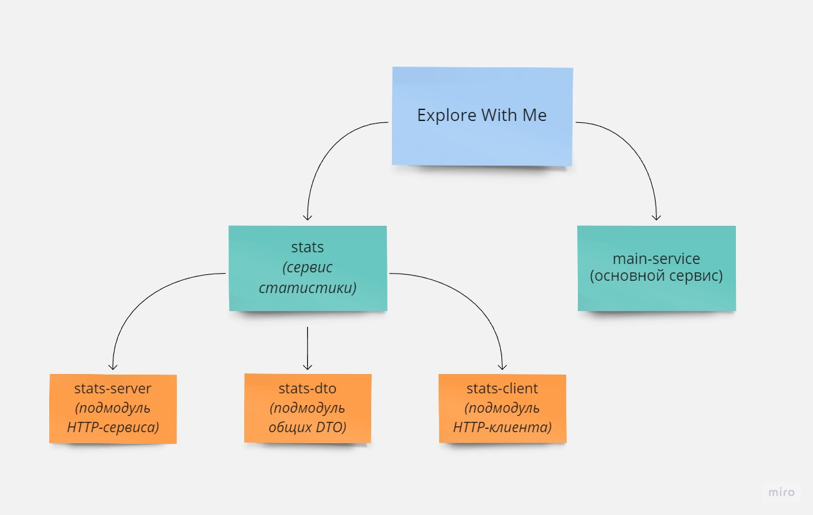

Explore With Me
========================
Приложение, позволяющее пользователям делиться информацией об интересных событиях и находить компанию для участия в них.

***

Архитектура приложения
-------------------------

Функции
-------------------------
* Настроено управление пользователями
* Налажена модерация событий, размещённых пользователями
* Доступны поиск и сортировка событий по параметрам или ключевым словам
* Создан механизм управления событиями для пользователей
* Настроена работа с заявками на участие в мероприятиях
* Реализован механизм комментирования событий
* Создана лента событий

Технологический стек
-------------------------
Java 11, Spring Boot, Maven, REST, Lombok, SQL, Postgres, JDBC, MapStruct, JPA, Docker Compose, Postman.

Требования
-------------------------
* JDK 11
* Docker
* Apache Maven 3.6.0

Установка
-------------------------
Сборка: 
>mvn clean package 

Запуск: 
> docker-compose up